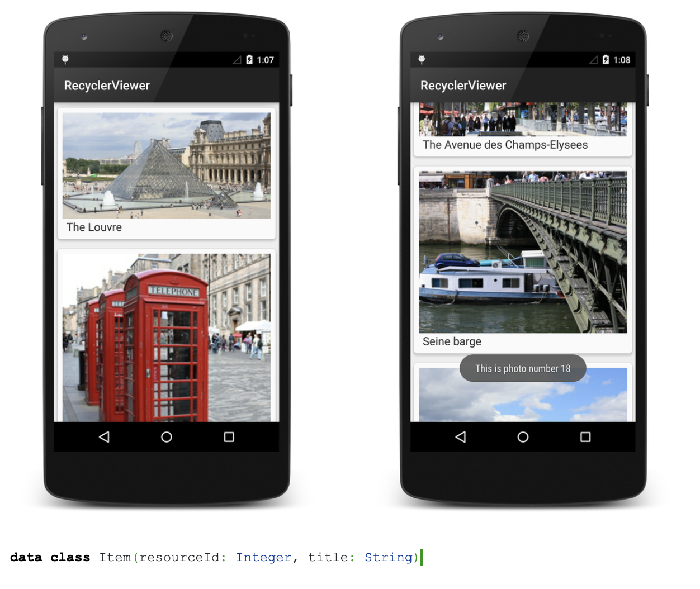

과제3
asset에 10개의 이미지를 저장하고 랜덤의 순서로 RecyclerView를 이용해서 세로 방향으로 이미지 리스트를 띄워라.
리사이클러뷰의 아이템은 아래 사진처럼 이미지와 제목으로 구성되어 있다.
이미지를 길게 누르면 파일의 이름이 AlertDialog로 출력되며, 화면 스크롤이 끝까지 닿은 경우 또 다시 랜덤의 순서로 이미지가 재배열된다.

